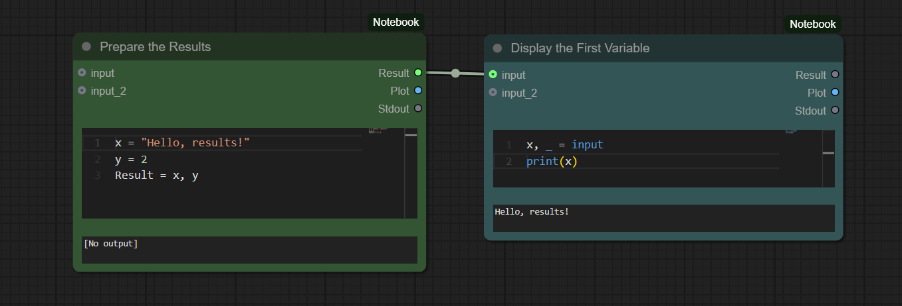
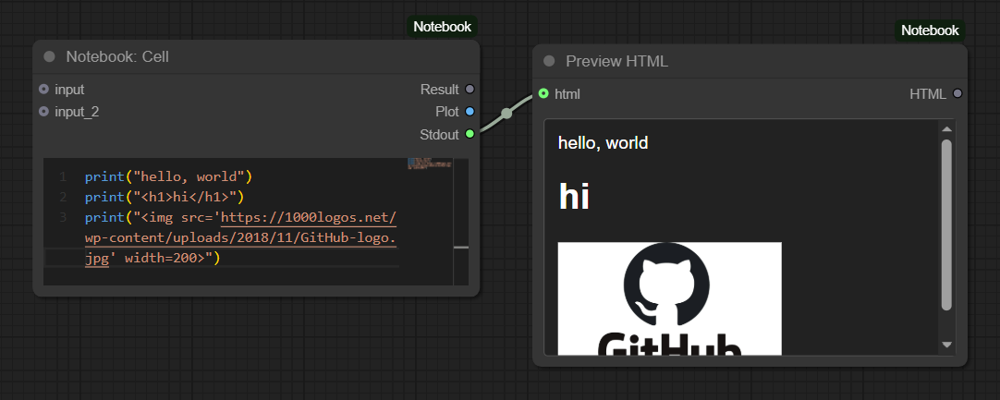

# Notebook - Python Exec Node for ComfyUI

A Jupyter-style custom node for executing Python code within [ComfyUI](https://github.com/comfyanonymous/ComfyUI) workflows.

## Features

-   Syntax highlighting with Monaco Editor (similar to VSCode)
-   Shared variables between cells via `globals` dictionary
-   Pre-loaded: numpy, torch, PIL, matplotlib
-   Plot generation and dynamic outputs

## Installation

Install [ComfyUI](https://github.com/comfyanonymous/ComfyUI).

Clone `ComfyUI-Notebook` (this repo) to `ComfyUI/custom_nodes/` and restart ComfyUI.

## Usage Examples

**Basic execution:**

```python
print(1 + 1)
```


**Plotting:**

```python
plt.figure(figsize=[8,5])
x = torch.randn([2,10])
plt.scatter(x[0], x[1])
```


**Sharing Data Between Cells:**

```python
# Cell 1
x = np.linspace(0, 10, 100)

# Cell 2
plt.figure(figsize=[5,6])
plt.plot(x, np.sin(x))
plt.title("Sine")
```


**Passing Results:**

```python
# Cell 1
x = "Hello, results!"
y = 2
Result = x, y

# Cell 2
x, _ = input
print(x)
```



**Output/Preview HTML:**



**Highlighted the Problematic Cell:**


**Investigating GPT-2's Weights:**


[Workflow: GPT-demo.json](./workflows/GPT-demo.json)

## Available Variables

-   `np`, `torch`, `Image`, `plt` - Common libraries pre-loaded

## License

MIT License
