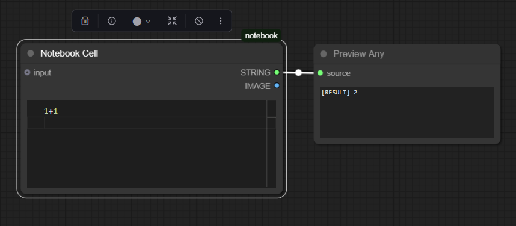
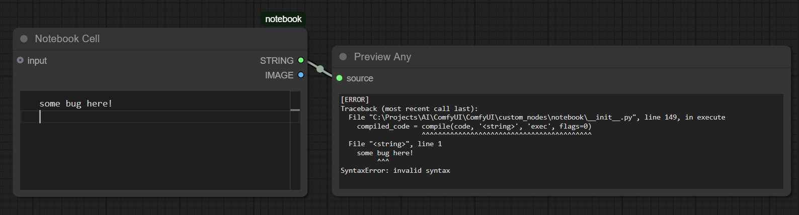

# Notebook - Python Exec Node for ComfyUI

A Jupyter-style custom node for executing Python code within ComfyUI workflows.

## Features

- Syntax highlighting with Monaco Editor (similar to VSCode)
- Shared variables between cells via `globals` dictionary
- Pre-loaded: numpy, torch, PIL, matplotlib
- Plot generation and dynamic outputs

## Installation

Clone `notebook` to `ComfyUI/custom_nodes/` and restart ComfyUI.

## Usage Examples

**Basic execution:**
```python
x = 1 + 1
x
```



**Plotting:**
```python
plt.figure(figsize=[8,5])
x = torch.randn([2,10])
plt.scatter(x[0], x[1])
```


**Sharing data between cells and creating plots:**
```python
# Cell 1
x = np.linspace(0, 10, 100)
globals['data_sine'] = x

# Cell 2
plt.figure(figsize=[5,6])
x = globals['data_sine']
plt.plot(x, np.sin(x))
plt.title("Sine")
```


**Redirecting stdout and stderror:**



**Investigating GPT-2's weights:**


[Workflow: GPT-demo.json](./workflows/GPT-demo.json)

## Available Variables

- `globals` - Shared dictionary (persists across executions)
- `np`, `torch`, `Image`, `plt` - Common libraries pre-loaded

## License

MIT License

